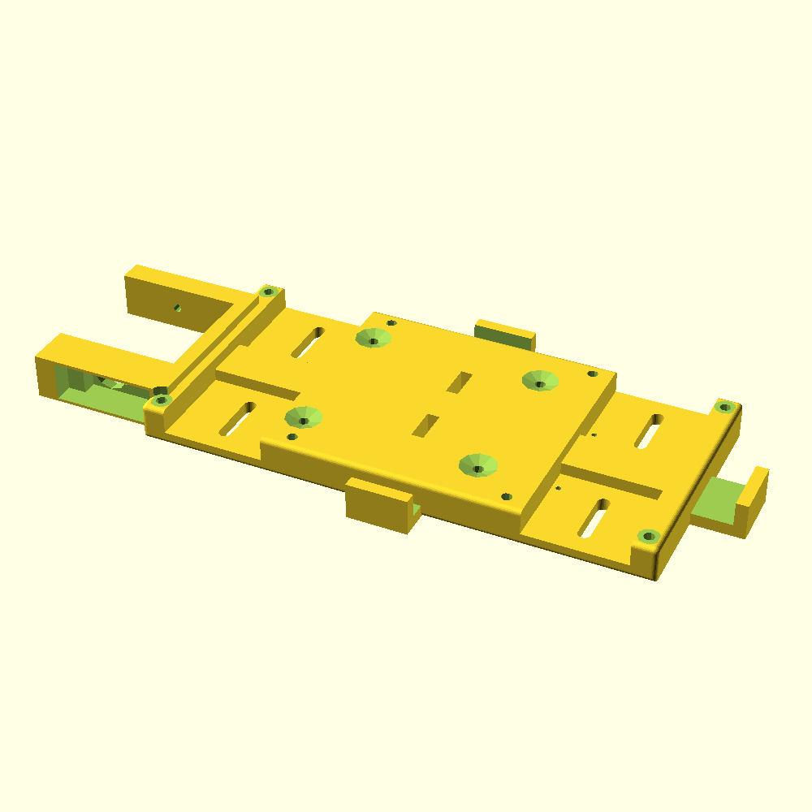
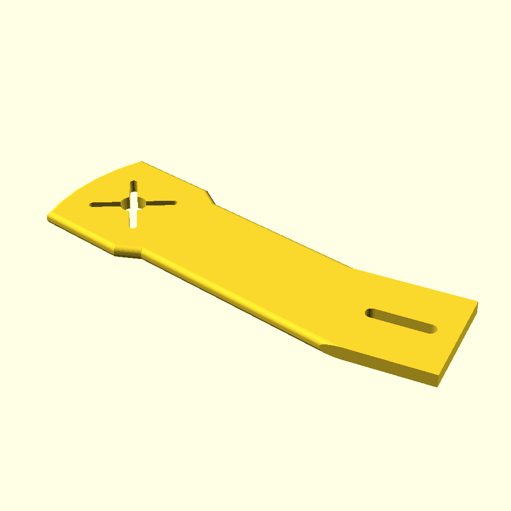
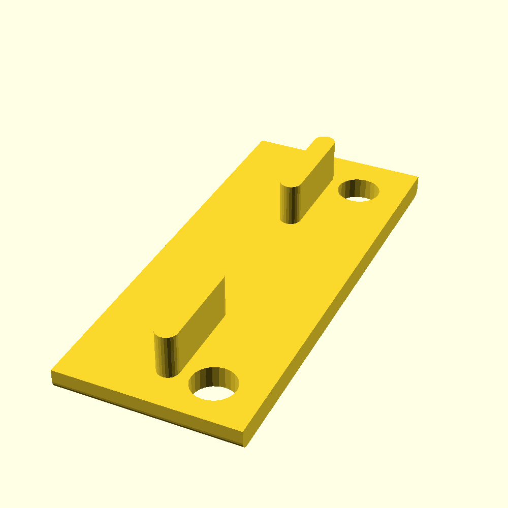
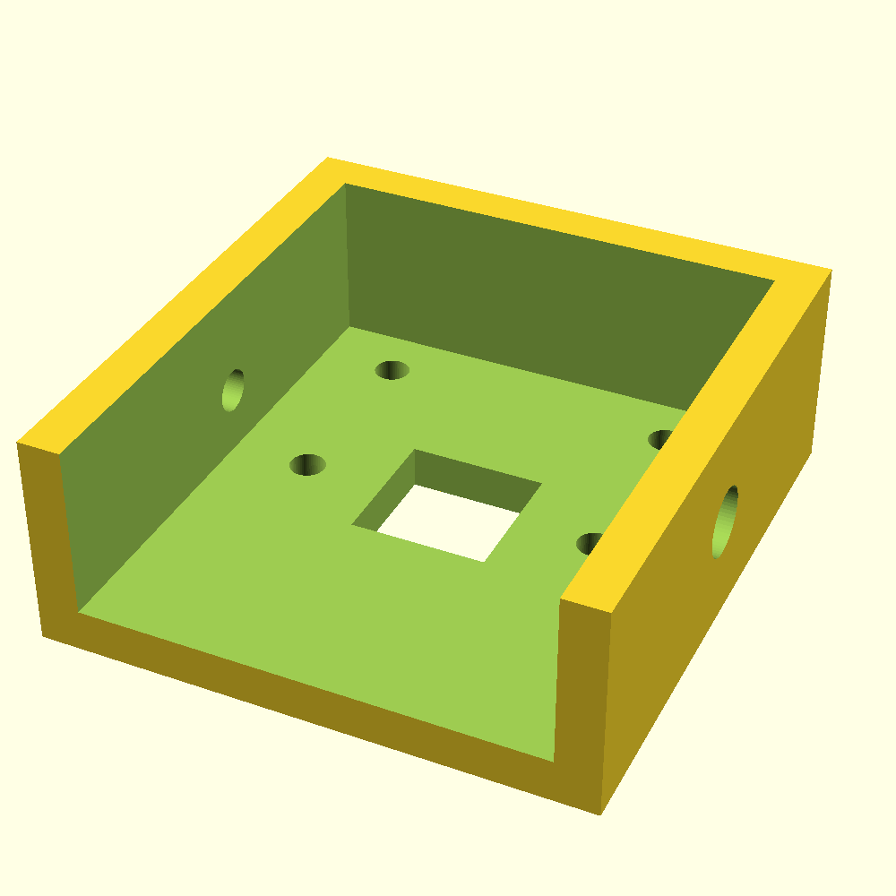
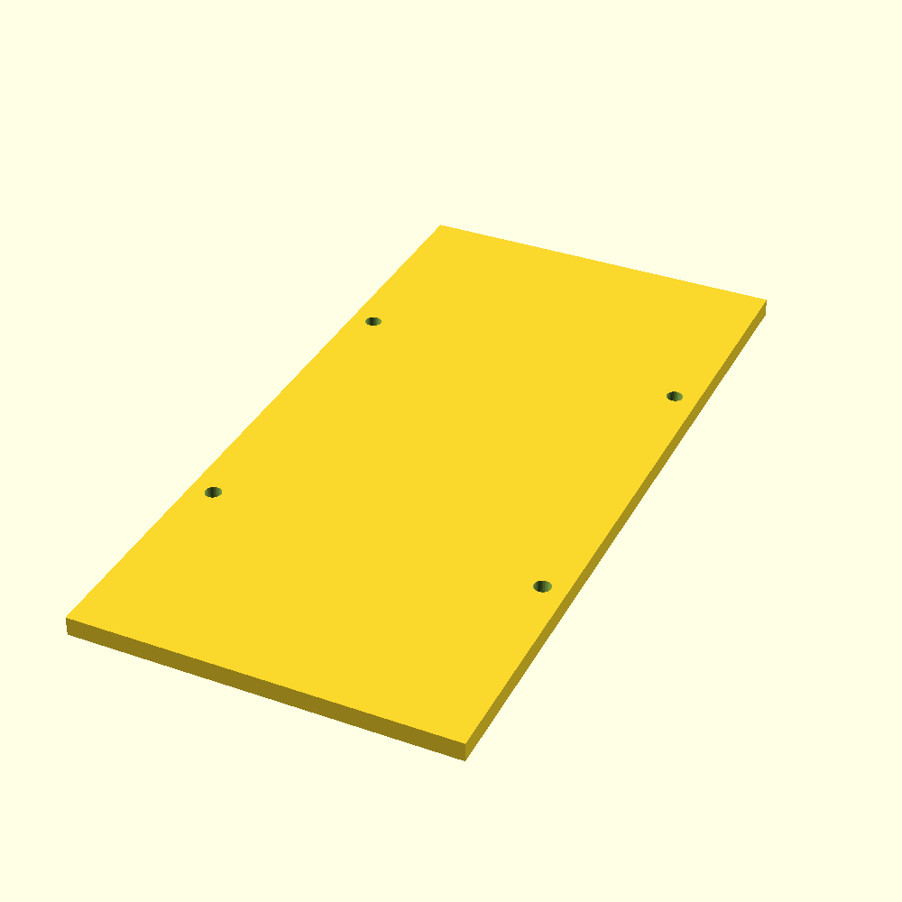

# Raspberry Pi Drone

This is designed for a Navio2 + RPi flight controller and a power system similar to the [DJI Snail](https://www.dji.com/snail) with a 3S (11.1V) LiPo. It is a modified version of the drone found [on Thingiverse here](https://www.thingiverse.com/thing:2269010).

It is particularly good for scenarios with potentially rough landings, as it is flexible enough to ragdoll a bit, while being strong enough to fly nicely.

## Initialization (if you want to edit or re-generate files):
* Install OpenSCAD: `sudo apt-get install openscad`
* Clone the repo to your computer.
* Run the `./build.sh` script (make sure you have OpenSCAD installed or else this step will obviously not work).

## Printing (drone with gimbal):

Print Item | Quantity | File | Image
:-: | :-: | :-: | :-: |
Body | 1 | `stl/body.stl` | 
Arms | 4 | `stl/arm.stl` | 
Connector plates | 2 | `stl/connector_plate.stl` | 
Camera mount | 1 | `stl/gimbal_camera_mount.stl` | 
Upper deck | 1 | `stl/upper_deck.stl` | 

## Assembly:
* Put one arm in each slot from the underside, angling them away from the center of the drone body.
* Connect the arms by pressing tab from the connector plates into the holes in the arms and the corresponding holes in the body. (You may need a [vice](https://www.google.com/search?q=vice&source=lnms&tbm=isch&sa=X&ved=2ahUKEwiJ9f6L45rzAhUGQUEAHXSoBQ8Q_AUoAXoECAEQAw&biw=1920&bih=981) for this. Make sure to do it slowly in order not to break anything.)
* Drill a hole through the connector plate and put a short M3 bolt through it with a nut for security.
* If using a snail propulsion system, you will need to increase the size of the slots in the arms for the required mounting screws. You can do this with a dremel or drill and a slightly larger bit. (This will eventually need to be fixed in the design itself, but is ok for now.)

## Parts List:
### Flight Controller:
* [1 x Raspberry Pi 4](https://www.raspberrypi.org/products/raspberry-pi-4-model-b/)
* [1 x Navio2 with full 433MHz telemetry radio + GPS + power module](https://navio2.emlid.com/)
* [1 x 40-pin GPIO extender (straight)](https://pimodules.com/wp-content/uploads/2019/06/40_Pin_Con.jpg)
* [4 x 10 mm male-to-female nylon M3 standoffs](https://ae01.alicdn.com/kf/HTB1ag2aPXXXXXcsXFXXq6xXFXXXz/50PCS-M3-Black-Nylon-Standoff-M3-5-6-8-10-12-15-18-20-25-30.jpg_640x640.jpg)
### Propulsion/Power:
* [1 x DJI Snail](https://www.dji.com/snail)
* [1-2 x 3S (11.1V) lithium polymer battery ~3300mAh](https://hobbyking.com/en_us/turnigy-battery-3300mah-3s-30c-lipo-pack-xt-60.html?___store=en_us)
* [1 x Small power distribution board (with at least 5 outputs)](https://www.amazon.com/LinsyRC-Distribution-Copper-Helicopter-Quadcopter/dp/B08H8GR53G/ref=sr_1_8?dchild=1&keywords=Power+Distribution+Board&qid=1632532148&sr=8-8)
### Peripherals
* [Micro receiver (and corresponding transmitter)](https://www.gravesrc.com/frsky-r-xsr-2-4ghz-16ch-micro-accst-receiver-with-s-bus-and-cppm.html)
* [1 x Raspberry Pi camera module with ribbon cable](https://www.raspberrypi.org/products/camera-module-v2/)
### Miscellaneous
* [1 x XT-60 connector pair](https://www.amazon.com/Amass-Bullet-Connector-Upgrated-Sheath/dp/B074PN6N4K)
* Various nuts and bolts
* Various small wires
* Electrical tape
* Velcro Straps

## Installation:
* Install the Raspberry Pi at the 4 mounting holes in the body, including spacers to separate it from the body. You can identify these holes unambiguously by the fact that they are the only 4 screw holes that line up with the holes in the Raspberry Pi. Install 4 x ~20mm M3 [countersink screws](https://m.media-amazon.com/images/I/41OX-HUqUYL.jpg) from the bottom up, and install the Raspberry Pi with the USB hub facing forward.
* Plug the camera ribbon cable into the Raspberry Pi's camera port.
* Install a 40-pin header extension on the GPIO rail of the Raspberry Pi, and install 4 x ~10mm standoffs on the 4 RPi mounting screws.
* Install the Navio2 on the Raspberry Pi, with the GPIO pins fitting into the Navio2 GPIO sockets, with M3 washers on top to keep it tight against the standoffs. Run the camera ribbon cable through the slot in the Navio2.
* Plug the GPS antenna into the antenna slot on the Navio2.
* Install the motors into the arms using the (presumably included with your motors) mounting screws. (Don't install the propellers until the very end!)
* Solder the ESC terminals to the power distribution board.
* Install the [power distribution board](https://www.dronetrest.com/uploads/db5290/original/2X/0/03304f2ce1f00f086263f404fa10f85d59372267.jpg) at the rear of the drone body with wood screws.
* Tape the ESCs in the holders on the sides and rear of the body. The front left motor's ESC is on the left side, the front right motor's ESC is on the right side, and the two back motors' ESCs are mounted in the same mount at the back.
* Install the Raspberry Pi camera module into the camera mount using M2 Allen head machine screws. (Be careful when tightening down - do not tighten too hard, and avoid touching the electronics on the rear of the camera module.) The lens of the camera fits into the square in the camera mount.
* Place the camera mount into its place at the front of the drone body.
* Insert the micro servo into its place at the front right of the drone body, press its head into the hole in camera mount, and install the servo with wood screws. Do not over-tighten - you can easily strip the screw hole.
* Install a 12mm M3 machine screw into the front left of the drone body while ensuring that the camera mount is locked onto the servo.
* Plug the free end of the camera's ribbon cable into the camera module.
* Screw a machine screw into each of the holes for mounting the upper deck (from the bottom up), and attach a 30 mm standoff on the other end.
* Align the upper deck to the standoffs and screw in again from the top.
* Tape a strap of velcro to the top of the battery, and tape the other side to the bottom of the drone body, so that the battery sticks to the drone.
* Run another velcro strap underneath the Raspberry Pi and all the way around the bottom of the battery. Stick it to itself.
* Tape the micro receiver to the outermost/rearmost side of the rear ESC mount, with the antennae facing down away from the propellers. Connect the receiver's SBus out pin to the Navio2's SBus in pin.
* Plug the 433 MHz telemetry radio into one of the USB ports on the Raspberry Pi, and tape it to the top of the upper deck using electrical tape or double sided tape.
* Tape the GPS antenna to the upper deck.

## Flight Control Software Setup
* Follow steps for installing the Emlid Raspbian OS on the Raspberry Pi and for setting up the flight control software.
* Calibrate all sensors and other systems.
* Ensure motors are spinning the correct way.
* Ensure correct flight controller orientation using the HUD in some ground control station software such as [QGroundControl](https://docs.qgroundcontrol.com/master/en/getting_started/download_and_install.html).
* Ensure that when you pitch forward, the back motors rev up, and that the front motors rev up when you pitch back.
* Ensure that when you roll right, the left motors rev up, and that the left motors rev up when you roll left.
* Ensure that the counterclockwise motors rev up when you yaw right, and vice versa.
* Install the propellers.

# Disclaimer: Add/subtract components, installation steps, etc. as needed, using common sense. Please use common sense.

# Still need to find some solution for legs in the drone body (maybe 3d printing, but probably not a good idea...)
